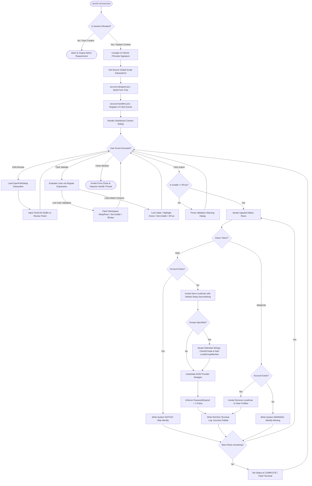

# Local Account Provisioning & Audit Tool (WinForms + PowerShell)

A modular, desktop-based Systems Administration and Security Auditing dashboard engineered in Windows PowerShell 5.1 and WinForms. This utility streamlines bulk lifecycle management for local operating system user identities and security group memberships, relying on structured Account Control List (ACL) manifests.

Designed for automated environments, deployment pipelines, and cybersecurity compliance auditing, the application provides a protective validation abstraction layer over destructive system-level account modifications.

---

## 🏗️ Structural Architecture & Separation of Concerns

The solution is decomposed into a strict decoupled layout pattern to maximize maintainability, ease debugging, and avoid variable leakage across functional modules:

```
📦 Repository Root
 ┣ 📜 account.ps1            # Main Bootstrapper, Environment Check & Assembly Interop
 ┣ 📜 account.globals.ps1    # Centralized Memory State, Type Schemas, Enums & Palette Constants
 ┣ 📜 account.designer.ps1   # WinForms Serialization, Node Instantiation & Coordinate Geometry
 ┣ 📜 account.functions.ps1  # Data Pipelines, Operating System Interactions & ADSI Layer
 ┣ 📜 account.handlers.ps1   # WinForms Event Hooks, Inter-Form Bridges & State Handlers
 ┗ 📜 account.resources.ps1  # Base64 Vector Streams, Binary Font Bundles & Form Controls Asset Map

```

| Component Module | Functional Engineering Responsibility |
| --- | --- |
| **`account.ps1`** | **Application Entry Point & Environment Ingestion.** Validates localized execution context (UAC elevated context check), imports the `Microsoft.PowerShell.LocalAccounts` assembly, declares native Win32 `user32.dll` interop signatures via P/Invoke (`Add-Type`), and dot-sources downstream dependency scripts before invoking the WinForms thread manager loop. |
| **`account.globals.ps1`** | **Global State & Schema Declarations.** Contains global system state flags (`$global:IsValid`), systemic regex rule definitions, color hex matrices mapped to log tracking priority weights, and the structured PowerShell `class LocalUserAccount` wrapper engine designed to safely bind native identity types. |
| **`account.designer.ps1`** | **Layout Engine & Visual Serialization.** Handles raw WinForms lifecycle assembly instantiation (`System.Windows.Forms`). Implements layout bounds, docking boundaries, control hierarchies (`Panel`, `RichTextBox`, `ToolStrip`, `Button`), tab ordering indices, and programmatically exposes elements to the global execution runtime. |
| **`account.functions.ps1`** | **Core Business Logic Layer.** Houses data extraction pipelines (`Import-ACLFile`), algorithmic pattern testing (`Invoke-ValidateFile`), identity interaction blocks (`New-LocalUser`, `Remove-LocalUser`), and the rich-text console stream formatting routine. |
| **`account.handlers.ps1`** | **Event Notification Pipeline.** Binds visual action handlers (such as form closures, menu dropdown selections, and button clicks) to transactional logic functions inside the business layer. Prevents thread deadlock across synchronous UI processes. |
| **`account.resources.ps1`** | **Asset Dictionary & Hex Memory Storage.** Stores base64 encoded streams for application icons, interface graphics, and embedded metadata lookup configurations, eliminating the need for external static image assets. |

---

## ⚙️ Application Flow & System Mechanics

The following functional diagram describes the complete application execution lifecycle, from initial context checks to localized security hardening.



---

## 🛠️ Deep Technical Blueprint

### 1. Hardened Validation RegEx Schema

To avoid malformed account strings polluting local security databases, input structures are evaluated against a strict regular expression before processing is unlocked:

```regex
^[^,]+,\s*[^,]+(;\s*[^,]+)*,\s*[^,]*,\s*(ADD|REMOVE)$

```

**Schema Structural Breakdown:**

* `^[^,]+` : Captures the literal target **Username** string (ensures at least one character is supplied up to the initial comma divider).
* `,\s*[^,]+(;\s*[^,]+)*` : Captures a semi-colon delimited array string mapping the target **Security Group** targets. Handles spaces seamlessly.
* `,\s*[^,]*` : Captures an optional string field describing the account **Description** parameter context.
* `,\s*(ADD|REMOVE)$` : Limits operations to explicit uppercase configuration tokens. Any row failing this target matches will drop out of processing and flag a terminal alert.

### 2. Managed Win32 Integration Layer

Rather than distributing secondary file assets to look up visual status badges, `account.ps1` natively marshals unmanaged code blocks to read into the `user32.dll` framework to pull core system asset libraries:

```csharp
[DllImport("user32.dll", SetLastError = true, CharSet = CharSet.Auto)]
public static extern uint PrivateExtractIcons(
    string lpszFile, int nIconIndex, int cxIcon, int cyIcon,
    IntPtr[] phicon, uint[] piconid, uint nIcons, uint flags
);

```

### 3. Immediate Account Expiration Policy (ADSI Framework)

To align with security baselines requiring new local users to change temporary provisioning credentials upon initial interactive logon, the tool calls Active Directory Service Interfaces (ADSI) immediately following group membership bindings:

```powershell
$User = [ADSI]"WinNT://localhost/$username,user"
$User.PasswordExpired = 1
$User.SetInfo()

```

*Note: Using ADSI maps directly onto standard system runtimes without needing heavy remote administration tooling models.*

---

## 📋 Pre-Flight Manifest Configuration

The input data manifest parsing model processes `.txt` or `.csv` files. Each line must adhere to the comma-separated structure outlined below:

### Ingestion Matrix Token Syntax:

```text
Username,Groups(Semicolon Delimited),Description,Action

```

### Reference File Content Example:

```text
svc.auditor, Performance Log Users;Power Users, Service profile for local metrics collection, ADD
sec.analyst, Administrators;Users, Elevated security assessment profile, ADD
retired.user, , Revoked staff profile, REMOVE

```

---

## 🚀 Deployment Instructions

### System Requirements:

* **Operating System Engine**: Windows 10, Windows 11, or Windows Server 2016+
* **System Interpreter**: Windows PowerShell Core v5.1 Engine Environment
* **Access Integrity Level**: Administrator Privileges (**Run as Administrator** is mandatory)

### Execution Sequence:

1. Open an elevated PowerShell session.
2. Clone or extract the modular script suite directory to your local drive workspace.
3. CD into the repository workspace node root path:
```powershell
Set-Location -Path "C:\Path\To\Repository"

```


4. Clear execution scope constraints if required on the local endpoint environment (`Set-ExecutionPolicy -ExecutionPolicy Bypass -Scope Process`).
5. Launch the management entry point bootloader script:
```powershell
.\account.ps1

```
